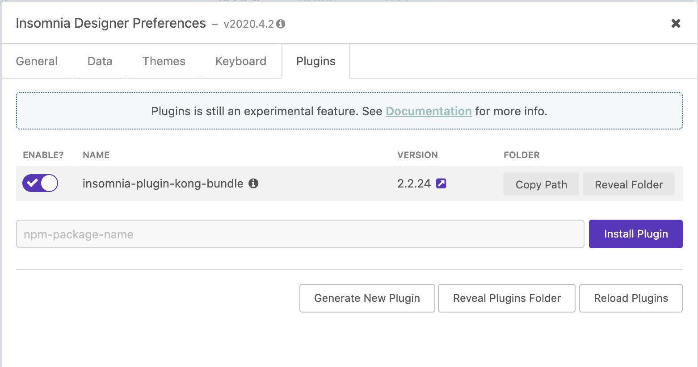

# spring-boot-kong
Example project showing how to integrate Spring Boot microservices with Kong API Gateway


Bringing together Kong & Spring Boot. But wait, what is https://github.com/Kong/kong ?

> Kong is a cloud-native, fast, scalable, and distributed Microservice Abstraction Layer (also known as an API Gateway or API Middleware). 


### Step by step...

Some microservices to access with Kong... I once worked heavily with the Spring Cloud Netflix tooling.

Here's the example project: https://github.com/jonashackt/cxf-spring-cloud-netflix-docker and the blog post I wrote back then https://blog.codecentric.de/en/2017/05/ansible-docker-windows-containers-scaling-spring-cloud-netflix-docker-compose

The goal is to rebuild the project using Kong https://github.com/Kong/kong


### Idea & Setup

Konga GUI

docker-compose

Integration: OpenAPI - Spring - Kong - Insomnia Designer


agnostical! more pattern like

Setup idea: Spring Boot REST / WebFlux --> [generate OpenAPI spec yamls via springdoc-openapi-maven-plugin](https://www.baeldung.com/spring-rest-openapi-documentation) --> Insomnia config file with [Kong Bundle plugin](https://insomnia.rest/plugins/insomnia-plugin-kong-bundle/) --> import into Kong and run via decK (normal Kong gateway without EE)

Nothing really there right now:  https://www.google.com/search?q=openapi+spring+boot+kong

* No change in Spring Boot dev workflow required, no custom annotations
* elegant integration of Kong and Spring Boot services

PLUS: CI process to regularly generate OpenAPI specs from Spring code -> and automatically import into Kong, which is an enterprise feature - or it is possible via:

Insomnia Inso CLI (https://support.insomnia.rest/collection/105-inso-cli)

See "From OpenAPI spec to configuration as code" in https://blog.codecentric.de/en/2020/09/offloading-and-more-from-reedelk-data-integration-services-through-kong-enterprise/


Next:
(backwards: OpenAPI --> Kong --> code)


### Create a Spring Boot App

This is the easy part. We all know where to start: Go to start.spring.io and create a WebFlux skeleton:


And then we need to implement a simple reactive REST service, that is able to serve a simple GET request.


##### Install Insomnia Desinger with Kong Bundle plugin

On a Mac simply (or have a look at https://insomnia.rest):

```
brew cask install insomnia-designer
```

Then go to https://insomnia.rest/plugins/insomnia-plugin-kong-bundle and click on `Install in Designer` & open the request in Insomnia Desinger:




## Links

https://blog.codecentric.de/en/2017/11/api-management-kong/

https://docs.konghq.com/hub/


#### Insomnia (Core) & Insomia Designer

> Insomnia (Core) is a graphical REST client - just like postman

https://blog.codecentric.de/2020/02/testen-und-debuggen-mit-insomnia/

Since 2019 Insomnia (Core) is part of Kong - and is the basis for Kong Studio (Enterprise)

https://github.com/Kong/insomnia


> Insomnia Designer is a OpenAPI / Swagger Desktop App

https://blog.codecentric.de/en/2020/06/introduction-to-insomnia-designer/

> you can preview your specification using Swagger UI

https://medium.com/@rmharrison/an-honest-review-of-insomnia-designer-and-insomnia-core-62e24a447ce


With https://insomnia.rest/plugins/insomnia-plugin-kong-bundle/ you can deploy API definitions into Kong API gateway

To see the integration in action, have a look on https://blog.codecentric.de/en/2020/09/offloading-and-more-from-reedelk-data-integration-services-through-kong-enterprise/ 

https://github.com/codecentric/reedelk-bookingintegrationservice


#### decK

> declarative configuration and drift detection for Kong

https://blog.codecentric.de/en/2019/12/kong-api-gateway-declarative-configuration-using-deck-and-visualizations-with-konga/

https://github.com/Kong/deck


#### Deployment incl. Konga

Official Kong docker-compose template: https://github.com/Kong/docker-kong/blob/master/compose/docker-compose.yml

https://blog.codecentric.de/en/2019/09/api-management-kong-update/

https://github.com/danielkocot/kong-blogposts/blob/master/docker-compose.yml


First question: What is this `kong-migration` Docker container about? [Daniel answers it](https://blog.codecentric.de/en/2019/09/api-management-kong-update/):

> the kong-migration service is used for the initial generation of the objects in the kong-database. Unfortunately, the configuration of the database is not managed by the kong service.


Idea: Database-less deployment possible for showcases?


> Konga: graphical dashboard

https://github.com/pantsel/konga#running-konga

https://blog.codecentric.de/en/2019/12/kong-api-gateway-declarative-configuration-using-deck-and-visualizations-with-konga/

Konga with it's own DB: https://github.com/asyrjasalo/kongpose/blob/master/docker-compose.yml

Konga on the same DB as Kong: https://github.com/abrahamjoc/docker-compose-kong-konga/blob/master/docker-compose.yml

